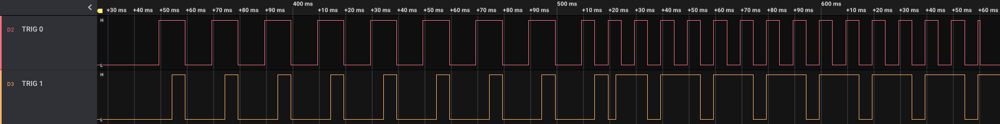

# Camera Trigger Gateware

### Background

This FPGA Gateware is for for the Capable Robot [Jetson TX2 / AGX Camera Interface](https://capablerobot.com/products/agx-camera-interface/).  This product:

- Exposes 6x MIPI CSI-2 Camera Interfaces (2-lane) on 22-pin, 0.5mm pitch ribbon cable connectors.
- Has an on-board Lattice ICE40UP5K FPGA provides independent or synchronized camera trigger and reset sigals. 
- Exposes an additional 4 GPIO / sync / trigger signals from the FPGA on an Auxiliary Connector (6-pin JST GH).


More information on the hardware is on the [Capable Robot website](https://capablerobot.com/products/agx-camera-interface/).

### Usage

Once flashed onto the SPI Flash, the gateware can be controlled via a set of registers via I2C from the host processor.  Currently, the register mapping is:

```
Name               Addr      Length  Default    RO
-----------------  ------  --------  ---------  -----
Product ID         0x00           6  CRFDJ1     True
Hardware Revision  0x06           1  10         True
Gateware Revision  0x07           1  1          True
Camera Count       0x0A           1  6          True
GPIO Count         0x0B           1  4          True
Trigger Count      0x0C           1  4          True

Clock Divider      0x14           1  10         False
Power Control      0x15           1  3          False
Power Sense        0x16           1  0          True

Crossbar A0        0x20           1  64         False
Crossbar A1        0x21           1  64         False
Crossbar A2        0x22           1  64         False
Crossbar A3        0x23           1  64         False
Crossbar A4        0x24           1  64         False
Crossbar A5        0x25           1  64         False
Crossbar A6        0x26           1  64         False
Crossbar A7        0x27           1  64         False
Crossbar B0        0x28           1  64         False
Crossbar B1        0x29           1  64         False
Crossbar B2        0x2A           1  64         False
Crossbar B3        0x2B           1  64         False
Crossbar B4        0x2C           1  64         False
Crossbar B5        0x2D           1  64         False
Crossbar B6        0x2E           1  64         False
Crossbar B7        0x2F           1  64         False

Trigger Enables    0x3C           1  0          False
Trigger0 Mode      0x40           1  0          False
Trigger0 Interval  0x41           1  0          False
Trigger0 Duration  0x42           1  0          False
Trigger0 Delay     0x43           1  0          False
Trigger1 Mode      0x48           1  0          False
Trigger1 Interval  0x49           1  0          False
Trigger1 Duration  0x4A           1  0          False
Trigger1 Delay     0x4B           1  0          False
Trigger2 Mode      0x50           1  0          False
Trigger2 Interval  0x51           1  0          False
Trigger2 Duration  0x52           1  0          False
Trigger2 Delay     0x53           1  0          False
Trigger3 Mode      0x58           1  0          False
Trigger3 Interval  0x59           1  0          False
Trigger3 Duration  0x5A           1  0          False
Trigger3 Delay     0x5B           1  0          False
```

**Important Note about the I2C Register Interface :** The gateware currently has a limitation where register can only be written-to or read-from one at a time.  If you want to update two numerically adjacent registers, you must do 2x 1-byte transactions instead of a 2-byte transactions.

### Notes on specific registers:

The **Clock Divider** register allows you to change how the internal 10 kHz clock is divides.  The default value is 10, which results in a 1 ms tick -- e.g. Trigger Interval, Duration, and Delay values are in 1 ms increments.  If trigger intervals longer than 255 ms are desired, the divider change be changed to a larger value.  A setting of 100 results in a 10 ms tick, meaning that Trigger Interval, Duration, and Delay values are in 10 ms increments -- allowing for intervals of 2.55 seconds.

The **Power Control** and **Power Sense** registers have the following bit field mapping:

* Bit 0 : Camera FFC 3.3v rail
* Bit 1 : Camera FFC 5.0v rail (provided via external connector)
* All other bits are reserved

The **Crossbar** registers have the following bit field mapping:

* Bit 0 to 3 : The trigger this output is assigned to
* Bit 4 : Reserved
* Bit 5 : Output inverts the assigned trigger
* Bit 6 : Default value for the output when Output Enable is false (default value is 1)
* Bit 7 : Output Enable

Crossbar A0 thru A7 are normally the "trigger" GPIO on attached camera while B0 thru B7 are normally the "reset / enable" GPIO on the attached camera -- but the crossbar allow arbitrary assignment between outputs and triggers, so the opposite mapping can be done.

Crossbar A0 and B0 connect to the FFC which contains CSI0 and who's I2C bus goes through output 0 of the I2C Mux.  Crossbar A1 and B1 map to CSI1 and I2C Mux ouptut 1, etc.  On the CRFDJ1 Interface there is an exception to this -- CSI6 and CSI7 connect to A4/B4 and A5/B5 and I2C Mux outputs 4 and 5.  You can consider CSI6 to be the 4th camera (0 indexing) on the interface and CSI7 to be the 5th camera (0 indexing).

The **Trigger Enable** register allows you to enable all, or a sub-set of triggers atomically.  Bit 0 enables trigger 0, bit 1 enables trigger 1, etc.

The **Trigger Mode** registers have the following capability:

* 0x00 : Trigger is stopped
* 0x01 : Trigger is idle.  Internal gateware logic will go to this state after a one-shot trigger is executed
* 0x02 : Interval trigger with a settable duration [..-...-...]
* 0x03 : Oneshot trigger with a settable duration [..-.......]
* 0x04 : Constant trigger (e.g. infinite one-shot) [..-------]

All trigger modes (Interval, Oneshot, Constant) respond to the delay register.  Trigger modes, intervals, durations, & delay can all be changed on the fly and settings take effect immediately.  If you are changing a number of settings, you might want to disable the trigger (via the appropiate bit in the Trigger Enable Register) to prevent partial updates.

### Example Interval Trigger

In the below screen shot the controller is configured like such:

* Trigger 0 is setup with an interval of 20 ms and a duration of 10 ms.
* Trigger 1 is setup with an interval of 20 ms and a duration of 5 ms, with a 5 ms delay.
* Triggers are enabled
* (100 ms pass)
* Trigger 0 interval is changed to 10 ms and duration changed to 5 ms.
* Trigger 1 is inverted (well actually, the invert bit on the crossbar output displayed is set) 
* (100 ms pass)
* Triggers are disabled



### Toolchain Installation

Install the [open-source FPGA toolchain](https://github.com/YosysHQ/fpga-toolchain).  

Then install [nmigen](https://github.com/migen/migen) and [tabulate](https://github.com/astanin/python-tabulate) via PIP:

```
pip install -r requirements.txt
```

### Building the Gateware

To target the PCB hardware:

```
python3 gateware/target.py ice
```

To emit a VCD from the simulator:

```
python3 gateware/target.py sim
```

The VCD file can be view using a viewer like [GTKWave](http://gtkwave.sourceforge.net) or [WaveTrace](https://www.wavetrace.io).  In this simulation, 2 ms pass before MODE is set to 0x02 (interval trigger) with a trigger duration of 2 ms and interval of 8 ms.  After 20 ms, the trigger duration and interval change to 5 ms and 10 ms.


### License

This project is distributed under the terms Apache 2.0 license.

See [LICENSE](LICENSE) for details.