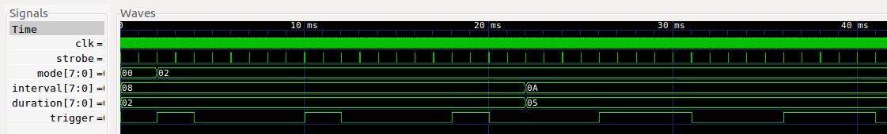

# Camera Trigger Gateware

### Background

This FPGA Gateware is for for the Capable Robot [Jetson TX2 / AGX Camera Interface](https://capablerobot.com/products/agx-camera-interface/).  This product:

- Exposes 6x MIPI CSI-2 Camera Interfaces (2-lane) on 22-pin, 0.5mm pitch ribbon cable connectors.
- Has an on-board Lattice ICE40UP5K FPGA provides independent or synchronized camera trigger and reset sigals. 
- Exposes an additional 4 GPIO / sync / trigger signals from the FPGA on an Auxiliary Connector (6-pin JST GH).


More information on the hardware is on the [Capable Robot website](https://capablerobot.com/products/agx-camera-interface/).

### Usage

Once flashed onto the SPI Flash, the gateware can be controlled via a set of registers via I2C from the host processor.  Currently, the register mapping is:

```
name               addr      length  default    ro
-----------------  ------  --------  ---------  -----
Product ID         0x00           6  CRZDGE     True
Hardware Revision  0x06           1  0          True
Gateware Revision  0x07           1  0          True
Reserved           0x08           8  0          True
Reset Mask         0x10           1  0          False
Trigger Mode       0x11           1  0          False
Trigger Interval   0x12           1  0          False
Trigger Duration   0x13           1  0          False
Trigger Mask       0x14           1  0          False
```

### Toolchain Installation

Install project [IceStorm toolchain](http://www.clifford.at/icestorm/).  Note that the Arachne-PNR tool is not used, NextPNR is the place-and-route tool.

Then install [nmigen](https://github.com/nmigen/nmigen) and [tabulate](https://github.com/astanin/python-tabulate) via PIP:

```
pip install -r requirements.txt
```

### Building the Gateware

To target the PCB hardware:

```
python3 gateware/target.py ice
```

To emit a VCD from the simulator:

```
python3 gateware/target.py sim
```

The VCD file can be view using a viewer like [GTKWave](http://gtkwave.sourceforge.net) or [WaveTrace](https://www.wavetrace.io).  In this simulation, 2 ms pass before MODE is set to 0x02 (interval trigger) with a trigger duration of 2 ms and interval of 8 ms.  After 20 ms, the trigger duration and interval change to 5 ms and 10 ms.



### License

This project is distributed under the terms Apache 2.0 license.

See [LICENSE](LICENSE) for details.